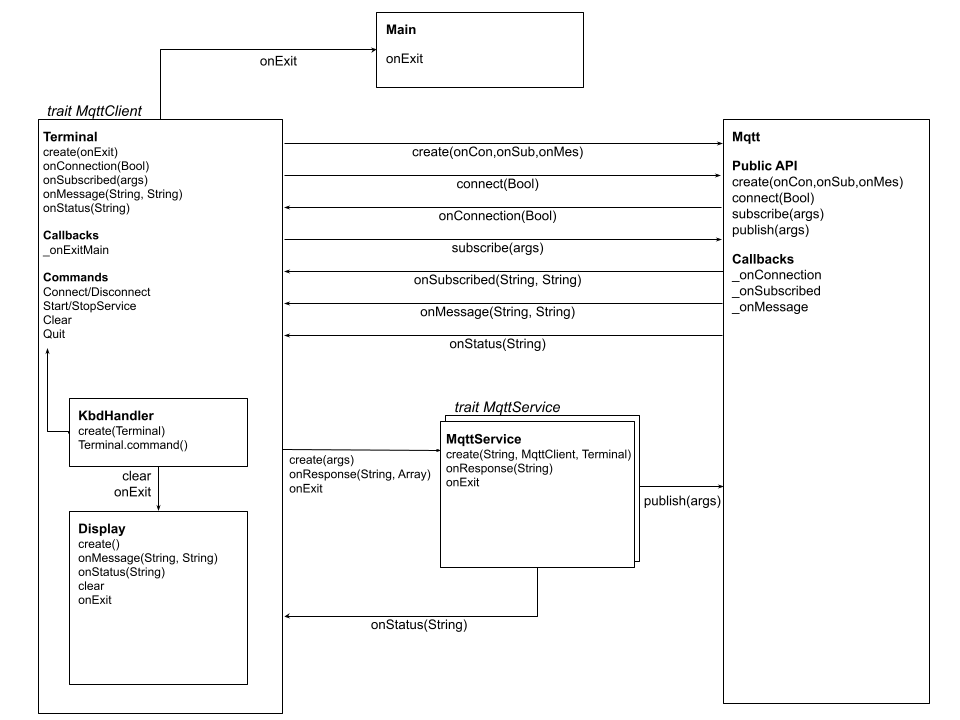

# Pony MQTT Client #

A MQTT 3.1.1 client - supports QoS 0/1/2 (Cleansession only). Currently part-way through release 0.2 (see package doc).

If you haven't used Pony, this is the best starting point -> [Pony Tutorial](https://tutorial.ponylang.io/index.html)

## Usage ##

